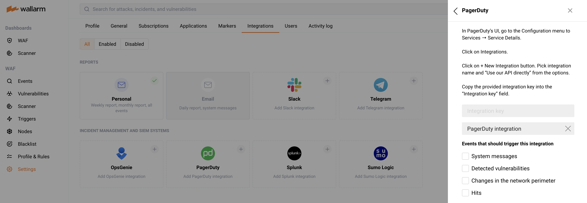

[link-pagerduty-docs]: https://support.pagerduty.com/docs/services-and-integrations

#   PagerDuty Notifications

You can set up Wallarm to send notifications to PagerDuty for the following events:

Notifications can be set up for the following events:

*   System related:
    *   new user created
    *   integration settings changed
*   [Vulnerability](../../../glossary-en.md#vulnerability) detected
*   Network perimeter changed
*   [Hit](../../../glossary-en.md#hit) detected

##  Setting up Notifications

In PagerDuty you can [set up an integration][link-pagerduty-docs] for any existing service or create a new service specifically for Wallarm:

1. Go to *Configuration* → *Services*.

2. Select an existing service by clicking its name to set up an integration for it or create a new service by clicking the *New service* button.

3. Create a new integration.

    *   If you are configuring integrations of the existing service, go to the *Integrations* tab and click the *New Integration* button.
    *   If you are creating a new service, enter the desired name for it into the *Name* field and proceed to the *Integration Settings* section.
    
4. Enter the desired name of the integration into the *Integration name* field (e.g. `Wallarm Integration`) and select the *Use our API directly* option as an integration type.

    *   If you are configuring integrations of the existing service, click the *Add Integration button*.
    *   If you are creating a new service, configure the rest of the settings sections and click the *Add Service* button.
    
5. Copy the *Integration Key* that corresponds to the new integration. It will be used later to create an integration on the Wallarm console.

To create a PagerDuty integration on the Wallarm console, perform the following actions:

1. Go to the *Integrations* tab of the *Settings*.

2. Click the *PagerDuty* block or click the *Add integration* button and choose *PagerDuty*.

    

3. Paste the integration key that was copied from the PagerDuty interface into the *Integration key* field.

4. Enter the integration name and select the event types you want to be notified of.

5. Save the integration by clicking the *Create* button.

You will now receive notifications on your PagerDuty account from the selected Wallarm event types.

## Disabling Notifications

1. Go to your Wallarm account > *Settings* > *Integrations* by the link below:
    * https://my.wallarm.com/settings/integrations/ for the [EU cloud](../../../quickstart-en/how-wallarm-works/qs-intro-en.md#eu-cloud)
    * https://us1.my.wallarm.com/settings/integrations/ for the [US cloud](../../../quickstart-en/how-wallarm-works/qs-intro-en.md#us-cloud)
2. Select an integration and click *Disable*.
3. Click *Save*.

## Removing Integration

1. Go to your Wallarm account > *Settings* > *Integrations* by the link below:
    * https://my.wallarm.com/settings/integrations/ for the [EU cloud](../../../quickstart-en/how-wallarm-works/qs-intro-en.md#eu-cloud)
    * https://us1.my.wallarm.com/settings/integrations/ for the [US cloud](../../../quickstart-en/how-wallarm-works/qs-intro-en.md#us-cloud)
2. Select an integration and click *Remove*.
3. Click *Sure?*.

!!! info "See also"
    * [Email reports and notifications](email.md)
    * [Slack notifications](slack.md)
    * [Telegram reports and notifications](telegram.md)
    * [OpsGenie notifications](opsgenie.md)
    * [Splunk notifications](splunk.md)
    * [Sumo Logic notifications](sumologic.md)