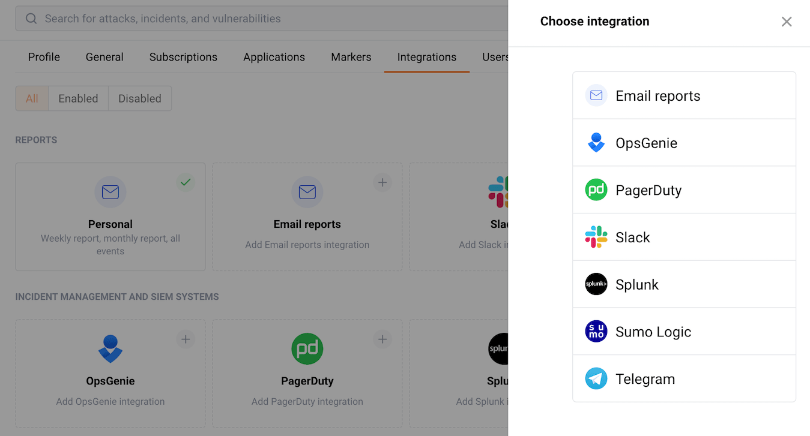

# Slack Notifications

You can set up Wallarm to send notifications to your Slack channel.

Notifications can be set up for the following events:

*   System-related:
    *   new user created
    *   integration settings changes
*   Vulnerability detected
*   Network perimeter changed

## Setting up Notifications

1. Open the *Settings* → *Integrations* tab.
2. Click the *Slack* block or click the *Add integration* button and choose *Slack*.

   
3. Go to the [WebHooks](https://my.slack.com/services/new/incoming-webhook/) link.
4. Select the Slack channel that will receive notifications. Click *Add Incoming WebHooks integration*.
5. Copy the link and put it in Wallarm into the *WebHook link field*.
6. Enter the integration name and select the event types you want to be notified of.
7. Click *Create*.

## Disabling Notifications

1. Go to your Wallarm account > *Settings* > *Integrations* by the link below:
      * https://my.wallarm.com/settings/integrations/ for the [EU cloud](../../../quickstart-en/how-wallarm-works/qs-intro-en.md#eu-cloud)
      * https://us1.my.wallarm.com/settings/integrations/ for the [US cloud](../../../quickstart-en/how-wallarm-works/qs-intro-en.md#us-cloud)
2. Select an integration and click *Disable*.
3. Click *Save*.

## Removing Integration

1. Go to your Wallarm account > *Settings* > *Integrations* by the link below:
      * https://my.wallarm.com/settings/integrations/ for the [EU cloud](../../../quickstart-en/how-wallarm-works/qs-intro-en.md#eu-cloud)
      * https://us1.my.wallarm.com/settings/integrations/ for the [US cloud](../../../quickstart-en/how-wallarm-works/qs-intro-en.md#us-cloud)
2. Select an integration and click *Remove*.
3. Click *Sure?*.

!!! info "See also"
    * [Email reports and notifications](email.md)
    * [Telegram reports and notifications](telegram.md)
    * [OpsGenie notifications](opsgenie.md)
    * [PagerDuty notifications](pagerduty.md)
    * [Splunk notifications](splunk.md)
    * [Sumo Logic notifications](sumologic.md)